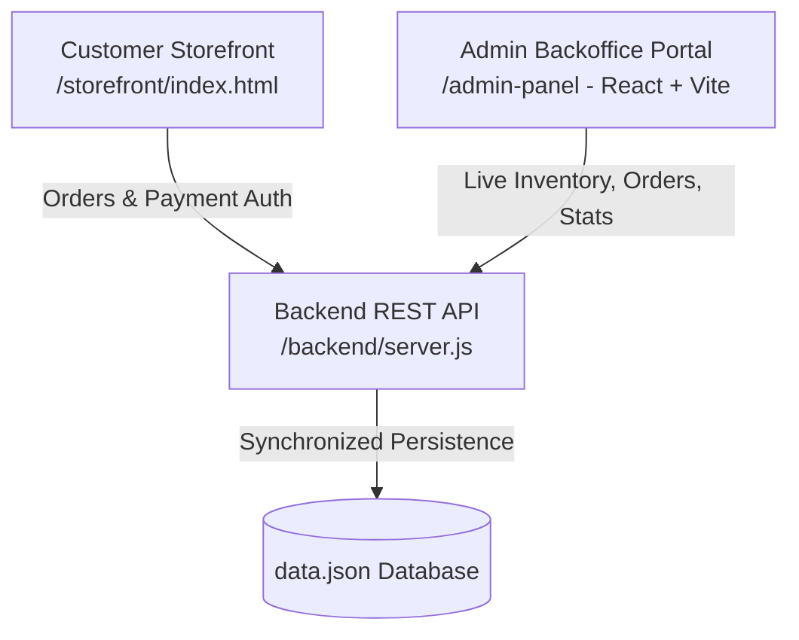

# RS Wellness Nutrition Hub & Backoffice Management System

An end-to-end e-commerce nutrition storefront, integrated Node.js Express backend API, and backoffice administrative management suite with interactive payment gateway integration (UPI QR, Cards, NetBanking, COD), real-time order tracking, and inventory synchronization.

---

## 🌟 Architecture Overview



---

## 📂 Project Structure

```
├── storefront/             # Customer-Facing Storefront (HTML5, Vanilla CSS, JS)
│   ├── index.html          # Responsive catalog, Cart, UPI/Cards Checkout & Tax Invoice
│   └── logo.png            # Brand Assets
├── admin-panel/            # Administrative Backoffice Portal (React + Vite + Tailwind)
│   ├── src/                # Pages (Dashboard, Products, Orders, Customers, Payments)
│   ├── package.json
│   └── vite.config.js
├── backend/                # REST API Server (Node.js + Express)
│   ├── server.js           # Endpoints for Products, Orders, Transactions, Coupons
│   ├── data.json           # JSON Database with sample Herbalife inventory & orders
│   └── package.json
├── start-demo.bat          # 1-Click Windows batch file to start all 3 services locally
└── README.md
```

---

## 🚀 Free Cloud Hosting Guide (100% Free)

You can host this entire project completely free for client demos and live sharing using **GitHub + Vercel + Render**:

### 1. Host Customer Storefront (Free on Vercel / GitHub Pages)
- **Option A (Vercel - Recommended)**:
  1. Go to [vercel.com](https://vercel.com) and import your GitHub repository.
  2. Set **Root Directory** to `storefront`.
  3. Click **Deploy**. Your store is live instantly on `https://your-project.vercel.app`!
- **Option B (GitHub Pages)**:
  1. In your GitHub repo settings, go to **Pages**.
  2. Select branch `main` and folder `/storefront` (or deploy via GitHub Actions).

### 2. Host Admin Backoffice Panel (Free on Vercel)
1. In [vercel.com](https://vercel.com), click **Add New > Project** and select this repository.
2. Set **Root Directory** to `admin-panel`.
3. Framework Preset: **Vite**
4. Build Command: `npm run build`
5. Output Directory: `dist`
6. (Optional) Set Environment Variable `VITE_API_BASE` to your hosted backend URL (e.g. `https://your-backend.onrender.com/api`).
7. Click **Deploy**.

### 3. Host Backend API (Free on Render.com)
1. Go to [render.com](https://render.com) and click **New > Web Service**.
2. Connect your GitHub repository.
3. Set **Root Directory** to `backend`.
4. Runtime: **Node**
5. Build Command: `npm install`
6. Start Command: `node server.js`
7. Click **Create Web Service**. Render gives you a free HTTPS URL (e.g. `https://rs-wellness-api.onrender.com`).

---

## 💻 Local Quick Start (Development & Demo)

### 1-Click Launch (Windows):
Double-click `start-demo.bat` in the root folder. It starts:
- 🛍️ **Storefront**: `http://localhost:3000`
- 📊 **Admin Panel**: `http://localhost:5173`
- ⚙️ **Backend API**: `http://localhost:5000`

### Manual CLI Launch:
```bash
# Terminal 1 - Backend API
cd backend
npm install
node server.js

# Terminal 2 - Customer Storefront
cd storefront
python -m http.server 3000

# Terminal 3 - Admin Backoffice Panel
cd admin-panel
npm install
npm run dev
```

---

## 💳 Payment Gateway Demo Features

- **UPI / QR Code**: Dynamic simulated QR code, VPA entry, Google Pay / PhonePe badges, and 1-Click Instant Auto-Pay.
- **Credit / Debit Cards**: Card formatting, expiry and CVV validation with brand detection.
- **Net Banking**: Instant bank selectors for major Indian banks.
- **Cash on Delivery (COD)**: Doorstep verification order flow.
- **Razorpay 3D Secure Simulation**: 2-stage verification popup with real authorization token generation.
- **Printable Tax Invoice & Receipt**: Instant GSTIN receipt with print / save-as-PDF action.
- **Live Admin Reflection**: Payments are immediately recorded and viewable at `http://localhost:5173/payments/transactions`.
